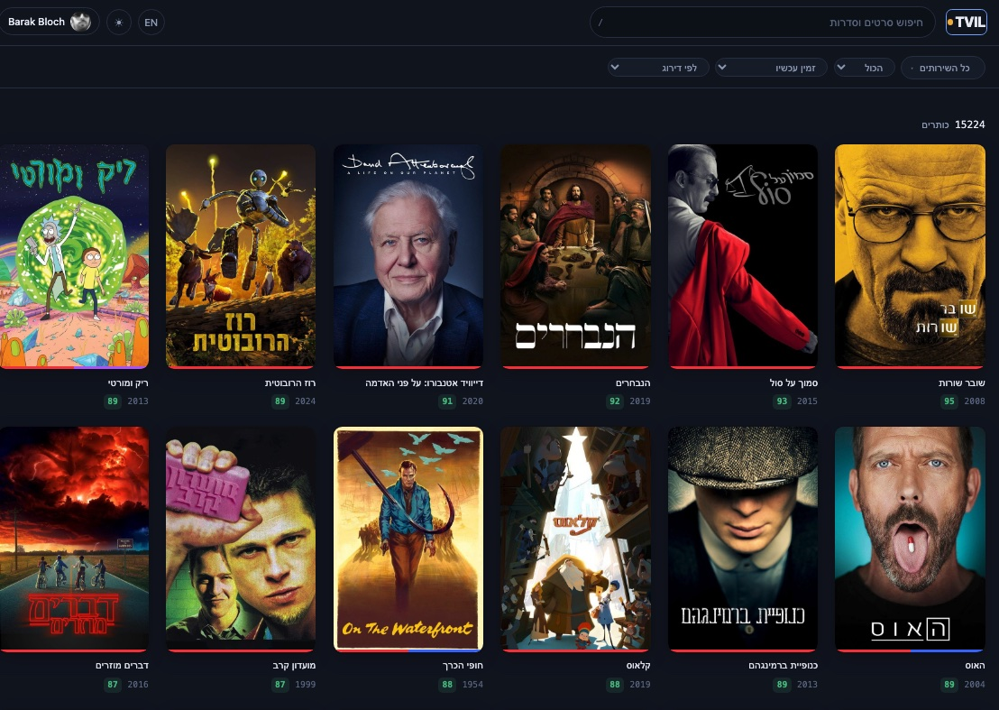
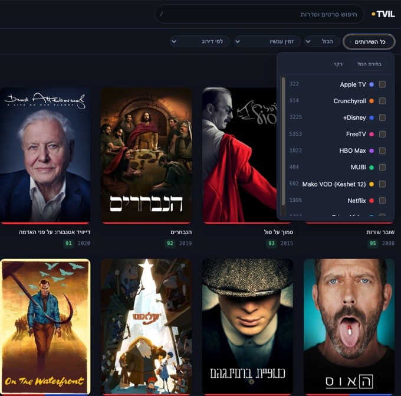
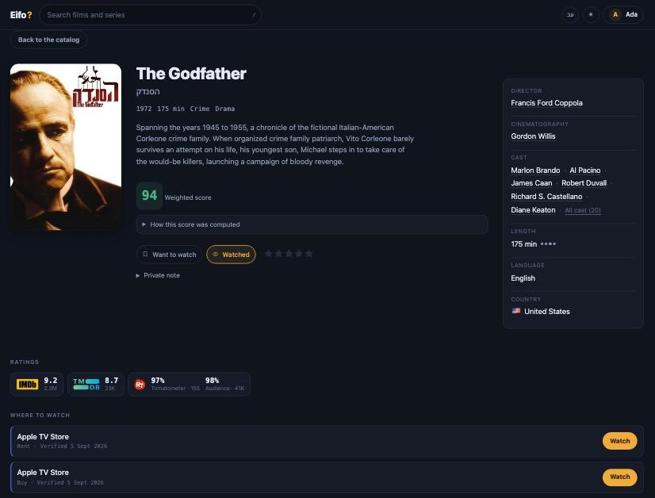

<div align="center">

# איפה · Eifo

### Which service is showing the thing I want to watch?

That's the whole idea. You have a film or a series in mind, or you just want something
good tonight - Eifo tells you where in Israel you can actually watch it, and whether it's
worth your evening.

<sub>*Eifo* (איפה) is Hebrew for **"where?"** - the question and the entire feature list.
For the pedants: **EIFO Indexes Films Online**.</sub>

[](https://github.com/barakbl/eifo/actions/workflows/ci.yml)
[](https://github.com/barakbl/eifo/actions/workflows/ci.yml)
[](LICENSE)
[](https://www.python.org/)

</div>

---

> [!IMPORTANT]
> **This was built for personal use.** It is a hobby project that scratches one person's
> itch, published in case it scratches yours. It is not a product, it carries no warranty,
> and nobody is on call for it.
>
> **This project is not affiliated with, endorsed by, or connected to any of the services
> it lists or any of the data providers it reads.** Every name and trademark belongs to its
> owner.
>
> **Anyone running it is responsible for their own compliance.** Your use of the data it
> retrieves is governed by the terms of the services it comes from - TMDB, JustWatch, IMDb,
> Rotten Tomatoes, Seret and each streaming service. Read them. See
> [Data, attribution and fair use](#data-attribution-and-fair-use).

---

## What it does

Israeli streaming is split across a dozen services, and no two of them agree on what they
carry. Eifo collects their catalogs into one place, enriches every title with the ratings
people actually trust, and puts a search box in front of it.

- **One catalog, not a dozen tabs.** FreeTV, the Israeli catalogs of Netflix, Disney+,
  Prime Video, Apple TV, HBO Max, MUBI and Crunchyroll, the free broadcaster VODs from
  Mako, Kan Box and Reshet 13, the Tel Aviv Cinematheque's rentals, and the Israeli Film
  Archive - whose 940-film collection is half free to watch. The other Israeli operators
  (yes+, Sting TV, HOT, Cellcom TV, Partner TV) publish nothing an honest client can
  read - [Coverage](#coverage) says why.
- **Filter by what you already pay for.** Tick your services once; the catalog narrows to
  what you can watch tonight without buying anything new. "Everything" stays one tap away.
- **Ratings worth trusting, side by side.** IMDb, Rotten Tomatoes (critics and audience),
  TMDB and the Israeli site Seret - each with a link back to where it came from, plus a
  weighted aggregate that **shows its working** rather than asking you to take a number on
  faith. Israeli titles get a separate Israeli score, because local critics and global
  audiences rarely rate the same film the same way.
- **Bilingual search that actually works.** Hebrew and English over one FTS5 index, with
  prefix matching as you type. "פאודה" and "Fauda" find the same series.
- **Who made it, and what else they made.** Every title page carries a metadata panel:
  director, cinematographer and cast, alongside language, country and running time. Every
  name links to that person's page, which lists everything the catalog credits them with,
  grouped by whether they directed it, shot it or appeared in it. Israeli titles get their
  credits from the archives that hold them, since TMDB carries little Israeli cinema, and
  those are the credits that exist nowhere else.
- **Small things that save a click.** Runtime comes with a four-dot scale, so you can tell
  a 95-minute film from a three-hour one without reading the number. Countries carry their
  flag. The cast list shows the billed leads and keeps the rest one tap away.
- **It remembers what left.** A title that vanished from a service is badged, not deleted -
  and a service Eifo no longer tracks is badged differently, because "it's gone" and "we
  can't vouch for this any more" are different facts.
- **Personal lists.** Sign in with Google or X to keep watched / want-to-watch lists, rate
  1-10, and write private notes. Notes are private always, including on a public profile.
- **Private by default.** New accounts are invisible. Going public is an explicit choice
  with copy that spells out exactly what becomes visible - and your email, sign-in identity,
  notes and chosen services never do.
- **Runs on a Raspberry Pi.** One SQLite file, one container, no cluster, no queue, no
  external observability stack.

Accounts are optional. Leave the OAuth credentials unset and Eifo serves the catalog to
everyone with no sign-in at all.

## A look at it

<div align="center">



<sub><b>Browse the whole catalog - search as you type, filter by service, Hebrew or English.</b></sub>

<br /><br />

<table>
  <tr>
    <td width="50%" valign="top">
      
      <br /><sub><b>Filter by the services you actually pay for - each with its title count.</b></sub>
    </td>
    <td width="50%" valign="top">
      
      <br /><sub><b>Keep watched / want-to-watch lists and rate 1-10.</b></sub>
    </td>
  </tr>
</table>

<br />



<sub><b>Every title: its ratings side by side, a private note, and where to watch it in Israel.</b></sub>

</div>

## Coverage

Which services Eifo can read, and how, grouped by what kind of service it is. **✅** has its
own catalog surface and per-title data; **◐** is tracked but with a caveat (coverage or
freshness); **❌** has a real catalog but no surface an honest client can reach without a
paying subscriber's login - so Eifo leaves it alone rather than spoof a browser or ride
someone's subscription ([why](#data-attribution-and-fair-use)).

| Service | Supported | Plugin | Notes |
|---|---|---|---|
| **Israeli operators** | | | *Paid subscriptions, sold here* |
| **FreeTV** | ✅ Yes | `freetv` | Public RedGalaxy JSON API - no key needed to read the catalog. The largest single source. `platform=BROWSER` is an undocumented convention, so a portal change could break it. |
| **Cellcom TV** | ❌ No | - | Real VOD library, but only inside the subscriber app - no honest public surface. |
| **HOT / NEXT** | ❌ No | - | Catalog API is reachable, but returns nothing without a paying subscriber's credential. |
| **yes+** | ❌ No | - | Host resets honest clients at the TLS handshake, and the catalog needs subscriber auth. |
| **Sting+** | ❌ No | - | Sibling of yes+ - same wall. |
| **Partner TV** | ❌ No | - | App host is closed to honest clients; the web player is login-gated. |
| **Global streamers** | | | *Israeli catalogs* |
| **Netflix** (IL) | ✅ Yes | `tmdb-providers` | Availability from JustWatch via the [TMDB API](#install) - **free key required**. The "watch" link goes to TMDB's per-title page, not the service's player; refreshed daily. |
| **Prime Video** (IL) | ✅ Yes | `tmdb-providers` | As Netflix - JustWatch via TMDB, free key. |
| **Apple TV** (IL) | ✅ Yes | `tmdb-providers` | As Netflix - JustWatch via TMDB, free key. |
| **HBO Max** (IL) | ✅ Yes | `tmdb-providers` | As Netflix - JustWatch via TMDB, free key. |
| **MUBI** (IL) | ✅ Yes | `tmdb-providers` | As Netflix - JustWatch via TMDB, free key. Films only. |
| **Crunchyroll** (IL) | ✅ Yes | `tmdb-providers` | As Netflix - JustWatch via TMDB, free key. |
| **Disney+** (IL) | ✅ Yes | `disney_plus` | Reads Disney's public per-region sitemaps - no key. (Absent from JustWatch's IL data, so it needs its own plugin.) |
| **Rent, buy and archive** | | | *Paid per title, price shown; some titles free* |
| **Cinematheque VOD** (Tel Aviv) | ✅ Yes | `cinematheque_vod` | Israeli and international arthouse film, paid for per title. One request reads the whole current offering; each title's price comes from the ticketing system and is shown beside the link, which goes to the film's page (synopsis and trailer) rather than straight to a checkout. Prices differ per film, and the occasional free one is badged free rather than as a rental at zero. |
| **Israel Film Archive** (Jerusalem) | ✅ Yes | `israel_film_archive` | The national archive streaming its own digitised collection: 941 films from 1920 onwards, **459 of them free to watch** and badged free; the rest rent at ₪15, priced from their own pages. Nothing on the site lists the collection, so this is the heaviest sync here - the sitemap, then one page per film, about 16 minutes at one request a second. |
| **Broadcaster VODs** | | | *Free to watch* |
| **Mako VOD** (Keshet 12) | ◐ Partial | `mako` | **Scrapes** the site's embedded catalog data (no key) - may break if Mako changes its page. Series/programmes only, no films. |
| **Kan Box** (Kan 11) | ◐ Partial | `kan` | Public broadcaster. The site 403s non-browser clients, so a stock headless Chromium reads the three server-rendered lobby pages (kan-box, series, digital) - one page view each per sync, nothing else. The Docker image ships the browser; from a checkout, `playwright install chromium`. |
| **Reshet 13** | ◐ Partial | `reshet13` | The site 403s non-browser clients, so the same stock headless Chromium as `kan` reads the two public screens (all shows, news) and their embedded catalog data - one page view each per sync, nothing else. Series/programmes only, no films. |

Ratings come from IMDb (datasets), TMDB, Rotten Tomatoes and Seret - the last two by scraping,
so they can lag or break when those sites change. Adding a service is a ~100-line plugin:
see [Hack on it](#hack-on-it).

## Install

Docker, or Python 3.12+ with [uv](https://docs.astral.sh/uv/). Plus a free
[TMDB API key](https://www.themoviedb.org/settings/api). Everything else is optional.

### With Docker (recommended)

```bash
git clone https://github.com/barakbl/eifo.git && cd eifo
cp config/eifo.example.toml config/eifo.toml
cp .env.example .env          # fill in EIFO_TMDB_API_KEY
docker compose up -d
```

Then fill the catalog - the first run takes a while, and is the only slow part:

```bash
docker compose exec fetcher eifo-fetch all
```

Open <http://localhost:8000>.

Nothing else to install: the image ships the headless Chromium that the Kan and Reshet 13
sources drive, so they work in a container with no setup on the host. That browser is most
of the image (roughly 1.7 GB with it, 0.4 GB without). If you leave `[sources.kan]` and
`[sources.reshet13]` off, put `EIFO_INSTALL_BROWSER=0` in `.env` before building and it
stays out.

### With uv, no container

```bash
git clone https://github.com/barakbl/eifo.git && cd eifo
uv sync
uv run playwright install chromium   # only for the Kan and Reshet 13 sources
cp config/eifo.example.toml config/eifo.toml
cp .env.example .env          # fill in EIFO_TMDB_API_KEY

uv run eifo-fetch db upgrade  # create the schema (the API would, but the fetcher runs first)
uv run eifo-fetch all         # fill the catalog
uv run uvicorn eifo_api.main:app --reload
```

Same address. The client is static files served by the same process - there is no build
step and nothing to compile. Skipping the `playwright install` line costs you Kan and
Reshet 13 and nothing else: without a browser each fails its own sync with a clear error
while every other source proceeds.

### Keeping it fresh

Catalogs move daily. The Docker setup includes a `fetcher` service running the bundled
daemon, so it keeps itself current with nothing further from you. Running without a
container, the same thing:

```bash
uv run eifo-fetch daemon      # sync 03:00, enrich 04:30, artwork 05:30 UTC
```

Or skip the long-running process and drive the phases from cron:

```bash
uv run eifo-fetch sync        # catalogs
uv run eifo-fetch enrich      # ratings and metadata
uv run eifo-fetch images      # posters and backdrops
```

Times come from `[schedule]` in `config/eifo.toml`. `eifo-fetch all` runs all three once.

Upgrading Eifo itself is `git pull` (or `docker compose pull`) and a restart: the API
applies any pending database migration as it starts. Set `auto_migrate = false` if you
would rather run `eifo-fetch db upgrade` yourself, in which case the API refuses to
serve a database it does not recognise.

One service at a time, which is how you test a new plugin or re-pull a service that broke:

```bash
uv run eifo-fetch sync --source kan --source mako   # repeatable, not comma-separated
uv run eifo-fetch sources list                      # state, title count, last sync
uv run eifo-fetch review list                       # listings no title could be matched to
```

### Turning on sign-in

Only needed if you want lists and ratings.

1. Create an OAuth client - [Google](https://console.cloud.google.com/apis/credentials)
   (Web application) and/or [X](https://developer.x.com/).
2. Register the callback: `https://your-host/api/v1/auth/callback/google` (and `/x`).
   `http://localhost:8000/...` works for local development.
3. Put the credentials plus a session secret in `.env`:

```bash
EIFO_SECRET_KEY=$(python -c "import secrets; print(secrets.token_urlsafe(48))")
EIFO_GOOGLE_CLIENT_ID=…
EIFO_GOOGLE_CLIENT_SECRET=…
```

Restart. A sign-in button appears for each provider you configured, and for no others.

Every setting, with its default, is in `config/eifo.example.toml` and `.env.example`.

## How it fits together

```
  streaming services ──► eifo-fetcher ──► SQLite ◄── eifo-api ──► web client
   ratings providers        plugins                                (no build)
```

| Path | What it is |
|---|---|
| `packages/eifo-core` | Settings, SQLAlchemy schema, Alembic migrations - the only contract between the services |
| `packages/eifo-fetcher` | `eifo-fetch` CLI: catalog sync, enrichment, artwork |
| `packages/eifo-api` | FastAPI REST service; also serves the client and the images |
| `web/` | Static HTML + JS client, vanilla ES modules |

Three deliberate choices, in case you were about to ask:

- **SQLite, not Postgres.** One writer, a few thousand readers a day, and a backup that is
  a file copy. Moving is explicitly not a goal.
- **No frontend framework.** No build step means the client is auditable, fast, and
  wrappable by Capacitor without a toolchain.
- **A missing catalog is never a mass deletion.** A title has to be absent from two
  consecutive *successful* syncs before it is marked gone, and a sync returning far fewer
  items than last time aborts as suspicious instead of wiping a service clean.

## Hack on it

**Pull requests are welcome, and new sources are the most useful thing you can add.**
Israel has more VOD services than this repo tracks, and every one of them is a plugin of
about a hundred lines.

### Adding a source

A plugin is a **pure producer**: it declares which services it covers and yields listings.
It never touches the database - matching, the availability sweep, artwork and the API all
happen downstream, which is what keeps a plugin small enough to test entirely from a
recorded fixture.

```python
class MyServicePlugin(SourcePlugin):
    def sources(self) -> list[SourceInfo]:
        return [
            SourceInfo(
                key="my_service",
                name="My Service",
                kind=SourceKind.SUBSCRIPTION,
                website_url="https://my.service.co.il",
            )
        ]

    def fetch(self, ctx: FetchContext) -> Iterator[RawItem]:
        for listing in ctx.http.get_json(CATALOG_URL)["items"]:
            yield RawItem(
                source_key="my_service",
                kind=TitleKind.MOVIE,
                name=listing["title"],
                year=listing.get("year"),
                deep_link_url=listing.get("url"),
            )
```

Start from `sources/mako.py` (a scraper) or `sources/tmdb_providers.py` (an API client
covering several services at once). For a site that will not serve a plain HTTP client,
`sources/kan.py` and `sources/reshet13.py` show the headless-browser variant built on
`browser.py` - the first parses rendered HTML, the second reads the JSON the page embeds.
Register it in `registry.py` - **or don't**: plugins are also discovered through the
`eifo.sources` entry-point group, so a source can live in its own repository and install as
an ordinary pip package with no change to this codebase.

A plugin that knows who made a title can say so: put `credits` on the `RawItem` and the
pipeline creates the people and attaches them, crediting your source. That is worth doing
for Israeli catalogues in particular, whose films TMDB has never heard of.

The pipeline handles everything after the yield: matching a listing to a canonical title,
parking the ambiguous ones for review, expiring what disappeared, and downloading artwork.

### Adding a ratings provider

Same shape, in `enrichers/`: add a `RatingProvider` enum member, give it a weight under
`[scores.weights]` in the config, and write the enricher. Normalisation to 0-100 and the
weighted aggregate are already handled.

### Other good first issues

Episode-level tracking for series, price *history* for rent/buy offers (an offer carries
its current price already), CSV or Letterboxd import, notifications when a want-to-watch
title lands on a service you have - the data model already supports the last one. A person
page links out to TMDB; IMDb needs one `imdb_id` column and a backfill through TMDB's
`/person/{id}/external_ids` before its link can point at the right human rather than a
search.

### House rules

Everything is tested, linted and typed; CI enforces all three, and the coverage gates
(90% for `eifo-core`, 85% elsewhere) are not negotiable.

```bash
uv run pytest                                        # the Python suite
node --test "web/tests/*.test.js"                    # the client's logic
uv run ruff check . && uv run ruff format --check .
uv run mypy
uv run pre-commit install                            # run all of it before each commit
```

**No test may touch the network.** Every parser is tested against a recorded fixture, so
the suite runs offline and a provider changing its HTML shows up as a failing test rather
than as silently missing data.

Small modules with one job, public functions typed and docstringed, comments that explain
*why* rather than narrate the code, and Conventional Commits.

If this is your first change here, add yourself to [AUTHORS](AUTHORS) as the last commit
of the pull request. That is the whole formality - there is no CLA.

## Data, attribution and fair use

Eifo displays data it does not own, and the licence in this repository covers the **code
only**. If you run your own instance, the obligations are yours:

- **TMDB** - metadata, artwork and cast/crew credits. Requires your own API key and carries
  an attribution requirement. This product uses the TMDB API but is not endorsed or
  certified by TMDB.
- **JustWatch** - streaming availability, reached via TMDB's provider data, with an
  attribution requirement.
- **IMDb** - ratings come from the official datasets, which are licensed for
  **personal and non-commercial use only**. No scraping.
- **Rotten Tomatoes**, **Seret** and the streaming services - scraped politely: one
  identifying user agent, `robots.txt` honoured, rate-limited, and no catalog is ever
  redistributed as a bulk download. The Israeli Film Archive is also where the director
  credits on its own films come from; each credit records the source that supplied it.

The API serves these credits from `GET /api/v1/meta` and the client displays them. **Do
not remove them.** If you intend to run this commercially, don't - the data licences above
do not permit it.

## Licence

[MIT](LICENSE) for the code, and everyone who has worked on it is credited in
[AUTHORS](AUTHORS). The data is not mine to license - see the section above.
