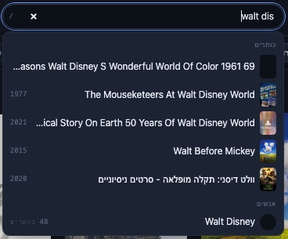
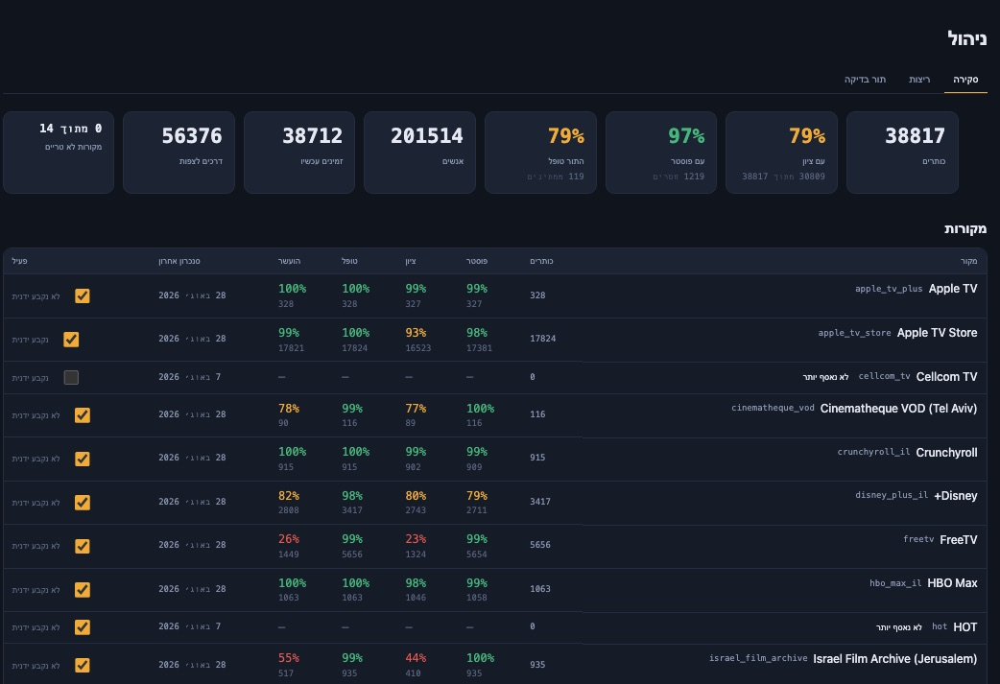

<div align="center">

# איפה · Eifo

### Which service is showing the thing I want to watch?

That's the whole idea. You have a film or a series in mind, or you just want something
good tonight - Eifo tells you where in Israel you can actually watch it, and whether it's
worth your evening.

<sub>*Eifo* (איפה) is Hebrew for **"where?"** - the question and the entire feature list.
For the pedants: **EIFO Indexes Films Online**.</sub>

[](https://github.com/barakbl/eifo/actions/workflows/ci.yml)
[](https://github.com/barakbl/eifo/actions/workflows/ci.yml)
[](LICENSE)
[](https://www.python.org/)

</div>

---

> [!IMPORTANT]
> **This was built for personal use.** It is a hobby project that scratches one person's
> itch, published in case it scratches yours. It is not a product, it carries no warranty,
> and nobody is on call for it.
>
> **This project is not affiliated with, endorsed by, or connected to any of the services
> it lists or any of the data providers it reads.** Every name and trademark belongs to its
> owner.
>
> **Anyone running it is responsible for their own compliance.** Your use of the data it
> retrieves is governed by the terms of the services it comes from - TMDB, JustWatch, IMDb,
> Rotten Tomatoes, Seret and each streaming service. Read them. See
> [Data, attribution and fair use](#data-attribution-and-fair-use).

---

## What it does

Israeli streaming is split across a dozen services, and no two of them agree on what they
carry. Eifo collects their catalogs into one place, enriches every title with the ratings
people actually trust, and puts a search box in front of it.

- **One catalog, not a dozen tabs.** FreeTV, the Israeli catalogs of Netflix, Disney+,
  Prime Video, Apple TV, HBO Max, MUBI and Crunchyroll, the free broadcaster VODs from
  Mako, Kan Box and Reshet 13, the Tel Aviv Cinematheque's rentals, and the Israeli Film
  Archive - whose 940-film collection is half free to watch. The other Israeli operators
  (yes+, Sting TV, HOT, Cellcom TV, Partner TV) publish nothing an honest client can
  read - [Coverage](#coverage) says why.
- **Filter by what you already pay for.** Tick your services once; the catalog narrows to
  what you can watch tonight without buying anything new. "Everything" stays one tap away.
- **Ratings worth trusting, side by side.** IMDb, Rotten Tomatoes (critics and audience),
  TMDB and the Israeli site Seret - each with a link back to where it came from, plus a
  weighted aggregate that **shows its working** rather than asking you to take a number on
  faith. Israeli titles get a separate Israeli score, because local critics and global
  audiences rarely rate the same film the same way.
- **Bilingual search that actually works.** Hebrew and English over one FTS5 index, with
  prefix matching as you type. "פאודה" and "Fauda" find the same series. The suggestions
  come from the same set as the results, filters and all - a dropdown that offers titles
  the grid then says do not exist is worse than no dropdown.
- **Who made it, and what else they made.** Every title page carries a metadata panel:
  director, cinematographer and cast, alongside language, country and running time. Every
  name links to that person's page, which lists everything the catalog credits them with,
  grouped by whether they directed it, shot it or appeared in it. Israeli titles get their
  credits from the archives that hold them, since TMDB carries little Israeli cinema, and
  those are the credits that exist nowhere else.
- **Small things that save a click.** Runtime comes with a four-dot scale, so you can tell
  a 95-minute film from a three-hour one without reading the number. Countries carry their
  flag. The cast list shows the billed leads and keeps the rest one tap away.
- **It remembers what left.** A title that vanished from a service is badged, not deleted -
  and a service Eifo no longer tracks is badged differently, because "it's gone" and "we
  can't vouch for this any more" are different facts.
- **Personal lists.** Sign in with Google or X to keep watched and want-to-watch lists -
  a title can be on both, because something seen and worth seeing again is not a
  contradiction - rate in five stars and their halves, and write private notes. Notes are
  private always, including on a public profile.
- **Filed from the grid, not from a page each.** Both list buttons sit on the poster in the
  catalog, so a page of results can be worked through without opening any of it - and
  because the state is drawn on every card, what you have already seen reads across the
  whole grid at once.
- **Private by default.** New accounts are invisible. Going public is an explicit choice
  with copy that spells out exactly what becomes visible - and your email, sign-in identity,
  notes and chosen services never do.
- **Runs on a Raspberry Pi.** One SQLite file, one container, no cluster, no queue, no
  external observability stack.

Accounts are optional. Leave the OAuth credentials unset and Eifo serves the catalog to
everyone with no sign-in at all.

## A look at it

<div align="center">


<sub><b>Browse the whole catalog - search as you type, filter by service, Hebrew or English.</b></sub>

<br /><br />

<table>
  <tr>
    <td width="50%" valign="top">
      
      <br /><sub><b>Filter by the services you actually pay for - each with its title count.</b></sub>
    </td>
    <td width="50%" valign="top">
      
      <br /><sub><b>Keep watched and want-to-watch lists, with your own rating on each.</b></sub>
    </td>
  </tr>
</table>

<br />



<sub><b>Search as you type, across both languages - and the people who made them, who are otherwise reachable only through a title they worked on.</b></sub>

<br /><br />


<sub><b>Every title: its ratings side by side, a private note, and where to watch it in Israel.</b></sub>

<br /><br />



<sub><b>The operator's tab, for anyone running their own: how complete the catalog is, and one row per service - coverage, last sync, and the switch that turns it on.</b></sub>

</div>

## Coverage

Which services Eifo can read, and how, grouped by what kind of service it is. **✅** has its
own catalog surface and per-title data; **◐** is tracked but with a caveat (coverage or
freshness); **❌** has a real catalog but no surface an honest client can reach without a
paying subscriber's login - so Eifo leaves it alone rather than spoof a browser or ride
someone's subscription ([why](#data-attribution-and-fair-use)).

| Service | Supported | Plugin | Notes |
|---|---|---|---|
| **Israeli operators** | | | *Paid subscriptions, sold here* |
| **FreeTV** | ✅ Yes | `freetv` | Public RedGalaxy JSON API - no key needed to read the catalog. The largest single source. `platform=BROWSER` is an undocumented convention, so a portal change could break it. |
| **Cellcom TV** | ❌ No | - | Real VOD library, but only inside the subscriber app - no honest public surface. |
| **HOT / NEXT** | ❌ No | - | Catalog API is reachable, but returns nothing without a paying subscriber's credential. |
| **yes+** | ❌ No | - | Host resets honest clients at the TLS handshake, and the catalog needs subscriber auth. |
| **Sting+** | ❌ No | - | Sibling of yes+ - same wall. |
| **Partner TV** | ❌ No | - | App host is closed to honest clients; the web player is login-gated. |
| **Global streamers** | | | *Israeli catalogs* |
| **Netflix** (IL) | ✅ Yes | `tmdb-providers` | Availability from JustWatch via the [TMDB API](#install) - **free key required**. The "watch" link goes to TMDB's per-title page, not the service's player; refreshed daily. |
| **Prime Video** (IL) | ✅ Yes | `tmdb-providers` | As Netflix - JustWatch via TMDB, free key. |
| **Apple TV** (IL) | ✅ Yes | `tmdb-providers` | As Netflix - JustWatch via TMDB, free key. The subscription only - Apple's storefront is a separate source, below. |
| **HBO Max** (IL) | ✅ Yes | `tmdb-providers` | As Netflix - JustWatch via TMDB, free key. |
| **MUBI** (IL) | ✅ Yes | `tmdb-providers` | As Netflix - JustWatch via TMDB, free key. Films only. |
| **Crunchyroll** (IL) | ✅ Yes | `tmdb-providers` | As Netflix - JustWatch via TMDB, free key. |
| **Disney+** (IL) | ✅ Yes | `disney_plus` | Reads Disney's public per-region sitemaps - no key. (Absent from JustWatch's IL data, so it needs its own plugin.) |
| **Rent, buy and archive** | | | *Paid per title, price shown; some titles free* |
| **Apple TV Store** (IL) | ◐ Partial | `tmdb-providers` | Rent and buy, and by a long way the largest catalog JustWatch reports for Israel: 17,799 films against the subscription's 110. Two things make it the most expensive source here. Whether a film is rented, sold or both is asked per title rather than assumed, because a discover listing cannot tell them apart. And TMDB stops paging any one query at 10,000 results, so the catalog is read one release year at a time - eighty listings instead of one, which reaches **17,770 of the 17,799** (the rest carry no release date, and no filter selects them). A full sync is about eighteen minutes and roughly 18,700 requests, so it is **off unless you switch it on**. Partial because no price is stored yet: nothing that reports these prices is reachable without breaking somebody's robots.txt. Films only. |
| **Cinematheque VOD** (Tel Aviv) | ✅ Yes | `cinematheque_vod` | Israeli and international arthouse film, paid for per title. One request reads the whole current offering; each title's price comes from the ticketing system and is shown beside the link, which goes to the film's page (synopsis and trailer) rather than straight to a checkout. Prices differ per film, and the occasional free one is badged free rather than as a rental at zero. |
| **Israel Film Archive** (Jerusalem) | ✅ Yes | `israel_film_archive` | The national archive streaming its own digitised collection: 941 films from 1920 onwards, **459 of them free to watch** and badged free; the rest rent at ₪15, priced from their own pages. Nothing on the site lists the collection, so this is the heaviest sync here - the sitemap, then one page per film, about 16 minutes at one request a second. |
| **Broadcaster VODs** | | | *Free to watch* |
| **Mako VOD** (Keshet 12) | ◐ Partial | `mako` | **Scrapes** the site's embedded catalog data (no key) - may break if Mako changes its page. Series/programmes only, no films. |
| **Kan Box** (Kan 11) | ◐ Partial | `kan` | Public broadcaster. The site 403s non-browser clients, so a stock headless Chromium reads the three server-rendered lobby pages (kan-box, series, digital) - one page view each per sync, nothing else. The Docker image ships the browser; from a checkout, `playwright install chromium`. |
| **Reshet 13** | ◐ Partial | `reshet13` | The site 403s non-browser clients, so the same stock headless Chromium as `kan` reads the two public screens (all shows, news) and their embedded catalog data - one page view each per sync, nothing else. Series/programmes only, no films. |

Ratings come from IMDb (datasets), TMDB, Rotten Tomatoes and Seret - the last two by scraping,
so they can lag or break when those sites change. Adding a service is a ~100-line plugin:
see [Hack on it](#hack-on-it).

## Install

Docker, or Python 3.12+ with [uv](https://docs.astral.sh/uv/). Plus a free
[TMDB API key](https://www.themoviedb.org/settings/api). Everything else is optional.

### With Docker (recommended)

```bash
git clone https://github.com/barakbl/eifo.git && cd eifo
cp config/eifo.example.toml config/eifo.toml
cp .env.example .env          # fill in EIFO_TMDB_API_KEY
docker compose up -d
```

Then fill the catalog - the first run takes a while, and is the only slow part:

```bash
docker compose exec fetcher eifo-fetch all
```

Open <http://localhost:8000>.

Nothing else to install: the image ships the headless Chromium that the Kan and Reshet 13
sources drive, so they work in a container with no setup on the host. That browser is most
of the image (roughly 1.7 GB with it, 0.4 GB without). If you leave `[sources.kan]` and
`[sources.reshet13]` off, put `EIFO_INSTALL_BROWSER=0` in `.env` before building and it
stays out.

### With uv, no container

```bash
git clone https://github.com/barakbl/eifo.git && cd eifo
uv sync
uv run playwright install chromium   # only for the Kan and Reshet 13 sources
cp config/eifo.example.toml config/eifo.toml
cp .env.example .env          # fill in EIFO_TMDB_API_KEY

uv run eifo-fetch db upgrade  # create the schema (the API would, but the fetcher runs first)
uv run eifo-fetch all         # fill the catalog
uv run uvicorn eifo_api.main:app --reload
```

Same address. The client is static files served by the same process - there is no build
step and nothing to compile. Skipping the `playwright install` line costs you Kan and
Reshet 13 and nothing else: without a browser each fails its own sync with a clear error
while every other source proceeds.

### Shell completions

`eifo-fetch` has eleven commands and several of them take a source key, so there are
completions for fish and zsh in [`completions/`](completions). Each one describes what a
command is for as it offers it, and completes source and enricher keys from your
configuration file - never from the database, because a completion runs on every keystroke
and should not be the reason a shell pauses.

```bash
# fish
ln -s "$PWD/completions/eifo-fetch.fish" ~/.config/fish/completions/

# zsh - put the directory on fpath before compinit, in ~/.zshrc
fpath=(/path/to/eifo/completions $fpath)
autoload -Uz compinit && compinit
```

They read `config/eifo.toml`, or whatever `EIFO_CONFIG_FILE` points at, falling back to
the example config - so `eifo-fetch sync --source <TAB>` offers the services this
deployment actually declares.

### With an AI assistant

If you would rather not read the two sections above, hand this to Claude Code, Codex,
Cursor or any agent with a shell, and answer its questions:

```text
Install and run Eifo from https://github.com/barakbl/eifo on this machine.

It is a self-hosted catalog of what is streaming in Israel: a Python 3.12 uv
workspace (eifo-core, eifo-api, eifo-fetcher) plus a static web client, all on
one SQLite file. Read the repository README first and follow it over any
assumption of your own.

Steps:
1. Check whether Docker or uv is installed and use that path. Prefer Docker.
2. Clone the repo somewhere sensible, then copy config/eifo.example.toml to
   config/eifo.toml and .env.example to .env.
3. Ask me for a free TMDB API key from
   https://www.themoviedb.org/settings/api and put it in .env as
   EIFO_TMDB_API_KEY. Do not invent a key, and never commit .env.
4. Start it. Docker: `docker compose up -d`. Otherwise: `uv sync`, then
   `uv run eifo-fetch db upgrade`, then
   `uv run uvicorn eifo_api.main:app --host 0.0.0.0 --port 8000`.
   On the uv path, run `uv run playwright install chromium` only if I want the
   Kan and Reshet 13 sources; the Docker image already ships that browser.
5. Fill the catalog once with `eifo-fetch all` (inside the fetcher container on
   the Docker path). Warn me it takes a while, then let it finish.
6. Verify: http://localhost:8000/api/v1/meta returns JSON and
   http://localhost:8000 serves the client. Tell me how many titles landed and
   which sources failed, if any.

Rules:
- This is an install, not a change: do not edit source files, and do not
  "fix" the code if something fails. Show me the actual error instead.
- Signing in is optional and needs OAuth credentials. Skip that section
  unless I ask.
- Everything it stores lives in data/ and config/. Tell me before deleting
  anything there.
```

An agent will happily run the whole thing unattended, so read what it proposes before you
let it loose on a machine you care about.

### Keeping it fresh

Catalogs move daily. The Docker setup includes a `fetcher` service running the bundled
daemon, so it keeps itself current with nothing further from you. Running without a
container, the same thing:

```bash
uv run eifo-fetch daemon      # catalogs, then ratings, then artwork - 03:00 UTC
```

Or skip the long-running process and put one line in cron:

```bash
uv run eifo-fetch all         # the same run, start to finish
```

The three phases are a chain rather than three jobs: enrichment needs the titles the
sync creates, and artwork needs the URLs enrichment fills in. The start time comes from
`[schedule]` in `config/eifo.toml`. They can still be run one at a time
(`eifo-fetch sync`, `enrich`, `images`) when you want just one of them.

<details>
<summary><b>On macOS, use launchd rather than cron</b></summary>

cron does not run a job the machine slept through - the occurrence is simply gone, not
deferred. On a Mac that sleeps overnight, a 03:00 crontab line may never fire at all, and
nothing will say so. launchd runs a missed `StartCalendarInterval` job as soon as the
machine wakes, which is the whole reason to prefer it here.

Save this as `~/Library/LaunchAgents/com.eifo.fetch.plist`, replacing both paths with
your own (`which uv` gives the first; the second is wherever you cloned Eifo):

```xml
<?xml version="1.0" encoding="UTF-8"?>
<!DOCTYPE plist PUBLIC "-//Apple//DTD PLIST 1.0//EN" "http://www.apple.com/DTDs/PropertyList-1.0.dtd">
<plist version="1.0">
<dict>
    <key>Label</key>
    <string>com.eifo.fetch</string>

    <key>ProgramArguments</key>
    <array>
        <string>/Users/you/.local/bin/uv</string>
        <string>run</string>
        <string>eifo-fetch</string>
        <string>all</string>
    </array>

    <key>WorkingDirectory</key>
    <string>/Users/you/eifo</string>

    <key>StartCalendarInterval</key>
    <dict>
        <key>Hour</key><integer>3</integer>
        <key>Minute</key><integer>0</integer>
    </dict>

    <key>StandardOutPath</key>
    <string>/Users/you/Library/Logs/eifo-fetch.log</string>
    <key>StandardErrorPath</key>
    <string>/Users/you/Library/Logs/eifo-fetch.log</string>

    <key>ProcessType</key>
    <string>Background</string>
</dict>
</plist>
```

Write it with an editor, or with a **quoted** heredoc (`cat > file <<'EOF'`). Pasting XML
straight into zsh does not work: `<?xml` looks like a redirection and `<!` triggers
history expansion, so the first two lines never reach the file and `launchctl` rejects the
result with the memorable `Bootstrap failed: 5: Input/output error`. `plutil -lint` on the
file says plainly what `launchctl` will not.

The absolute path to `uv` and the `WorkingDirectory` both matter: a scheduled job inherits
almost no `PATH`, and `config/eifo.toml`, `data/eifo.db` and `.env` are all resolved
relative to the working directory.

```bash
launchctl bootstrap gui/$(id -u) ~/Library/LaunchAgents/com.eifo.fetch.plist
launchctl kickstart -p gui/$(id -u)/com.eifo.fetch   # run it now rather than waiting
launchctl print gui/$(id -u)/com.eifo.fetch | head   # state, and the last exit code
tail -f ~/Library/Logs/eifo-fetch.log
```

`launchctl bootout gui/$(id -u)/com.eifo.fetch` removes it again. The exit code is worth
reading: 0 is a clean run, 2 means it finished but at least one source failed, 1 is fatal.

Two limits worth knowing. A LaunchAgent runs only while you are logged in - put the plist
in `/Library/LaunchDaemons` instead if it must run at the login screen, at the cost of
running as root. And if a scheduled run appears to do nothing at all, the usual cause is
Full Disk Access: macOS blocks scheduled processes from parts of the filesystem, so a
checkout under `~/Documents` or `~/Desktop` needs the permission granted in System
Settings, and one outside those does not.

</details>

Only one fetcher runs at a time, whichever way you start it. A second one - cron firing
over a daemon that is still going, or an impatient second terminal - notices, says so and
exits without doing anything, rather than competing for the database and asking every
source for the same catalog twice.

A run that stops happening is the failure worth catching, and nothing inside the box can
report its own absence. Set `EIFO_HEALTHCHECK_URL` to a watchdog that takes a plain GET
(healthchecks.io, an Uptime Kuma push monitor) and the run pings it as it starts,
finishes, and fails.

Upgrading Eifo itself is `git pull` (or `docker compose pull`) and a restart: the API
applies any pending database migration as it starts. Set `auto_migrate = false` if you
would rather run `eifo-fetch db upgrade` yourself, in which case the API refuses to
serve a database it does not recognise.

One service at a time, which is how you test a new plugin or re-pull a service that broke:

```bash
uv run eifo-fetch sync --source kan --source mako   # repeatable, not comma-separated
uv run eifo-fetch sources list                      # state, title count, last sync
uv run eifo-fetch review list                       # listings no title could be matched to
```

A sync reads several catalogs at once and writes them one at a time. Nearly all of a run
is spent waiting on other people's servers, so reading four sites side by side is most of
a night's wall-clock; the writing stays serial because SQLite takes a single writer, and
two syncs writing at once is not a faster night but a `database is locked`. The unit is
the plugin rather than the source - a plugin owning a dozen services reads them in turn,
because they come from one upstream API on one rate limit - and no site is asked for more
per second than before, since the per-host limit is unchanged and shared.

```bash
uv run eifo-fetch sync --concurrency 1   # one catalog after another, as it used to
uv run eifo-fetch sync --concurrency 8   # or set [fetch] concurrency in the config
```

Every source says where it has got to as it goes, on the round hundreds and at least
every fifteen seconds, so a long scrape is visibly working rather than possibly hung:

```
eifo.fetch.source.freetv  read 400 listings so far
eifo.fetch.pipeline       freetv: 400 listings in - 12 new titles, 12 new offers, 388 already listed
```

Those lines are on the source's own run row in the Runs tab, including the ones logged
while its catalog was still being read.

Enrichment can leave parts out for one run, which is what a catch-up over a large backlog
usually wants. The enrichers are not equally priced: TMDB is an API and answers at twenty
requests a second, while `rt` is scraped and runs at a rate chosen to be polite to
somebody's website - so it costs an order of magnitude more per title and supplies
ratings rather than the posters and names a new title is missing.

```bash
uv run eifo-fetch enrich --limit 10000 --skip rt    # metadata and posters, fast
uv run eifo-fetch enrich --skip rt --skip imdb      # repeatable; --skip-imdb is the same
```

Skipping is per run and never edits the configured set, so a catch-up cannot quietly
become the new normal. To switch one off for good, use `disabled` under `[enrich]`.

Titles that never matched TMDB - named with decoration a strict comparison cannot see
past, like "Star Wars The Force Awakens Episode VII" - can be given another try:

```bash
uv run eifo-fetch rematch            # print what would match; writes nothing
uv run eifo-fetch rematch --apply    # adopt ids, fold duplicates, and let the
                                     # next enrich pass fill in the rest
```

It acts only where exactly one record qualifies - measured against 2,059 titles whose
right answer was already known, that refusal to guess made zero errors - and prints the
ambiguous ones rather than choosing between a remake and its original.

### Turning on sign-in

Only needed if you want lists and ratings.

1. Create an OAuth client - [Google](https://console.cloud.google.com/apis/credentials)
   (Web application) and/or [X](https://developer.x.com/).
2. Register the callback: `https://your-host/api/v1/auth/callback/google` (and `/x`).
   `http://localhost:8000/...` works for local development.
3. Put the credentials plus a session secret in `.env`:

```bash
EIFO_SECRET_KEY=$(python -c "import secrets; print(secrets.token_urlsafe(48))")
EIFO_GOOGLE_CLIENT_ID=…
EIFO_GOOGLE_CLIENT_SECRET=…
```

Restart. A sign-in button appears for each provider you configured, and for no others.

Every setting, with its default, is in `config/eifo.example.toml` and `.env.example`.

### The Manage tab

Nobody is an administrator until you say so, so this is off on a fresh install and the tab
does not appear at all. Turning it on is one line, and the address has to match the account
you actually sign in with:

```bash
EIFO_ADMIN_EMAILS=you@example.com          # comma-separated for more than one
```

Restart, then sign out and back in - whether you are an administrator is settled when your
session is authenticated. The link is in the account menu, beside **My list** and
**Settings**, and the tab lives at `#/manage`.

There is deliberately no way to become one from inside the product. The first administrator
has to come from somewhere, and "whoever signed in first" is how a public instance hands
itself to a stranger. Every endpoint behind the tab answers 404 rather than 403 to everybody
else: a signed-in stranger is not owed the knowledge that it is there.

Three panels:

| Panel | Answers |
|---|---|
| **Overview** | Is the catalog alright. The three figures that are really shares - with a score, with a poster, review queue cleared - lead with the percentage, green above 95, amber above 75, red below, with the count they were taken from underneath. Everything is stated so that more is better, which is what lets one colour scale read the same across all of them. |
| **Sources** | Is *this* source alright - a row each, with the share of its titles that carry a poster, a score, an enrichment attempt and a cleared queue, when it last synced, and a switch. |
| **Runs** | What happened last night - every fetcher run with what it counted, and the tail of what it said while it ran. |

**The run log is the part worth knowing about.** Runs were always recorded - when they
started, how they ended, what they counted - but the *reason* a night went wrong lived only
on the stderr of a process nobody was watching. Now `eifo-fetch` keeps the tail of what each
run said and stores it on the row, which is usually the whole answer to "why did mako return
nothing this time".

**The source switch is an override, not a copy of your config file.** Left alone it means
"whatever `[sources]` says", so switching one source off does not quietly freeze the other
twelve at whatever the file happened to say that day. Nothing needs restarting.

**Switching one on also fetches it.** Permission and intent are the same gesture here:
nobody turns a service on to look at an empty row until the small hours. The API cannot
call the fetcher - the database is all the two share - so the ask is recorded on the source
and the daemon picks it up within half a minute, syncing that source alone. The row says
"sync queued" until it has. Switching off withdraws a pending ask. Without the daemon
running the ask simply keeps until the next sync by any route, including a hand-run one.

**The review queue** is where listings the matcher could not place get ruled on. A parked
listing is not in the catalog at all - no title, nothing to search for - so a queue that
grows is content going missing. The tab puts the source's offer beside the title it might
be, with three answers of one tap each and `1`/`2`/`3` plus `j`/`k` for working through a
backlog at speed. A ruling takes effect immediately. The same three rulings are available
from the CLI (`eifo-fetch review`), which is still the right tool over SSH.

## How it fits together

```
  streaming services ──► eifo-fetcher ──► SQLite ◄── eifo-api ──► web client
   ratings providers        plugins                                (no build)
```

| Path | What it is |
|---|---|
| `packages/eifo-core` | Settings, SQLAlchemy schema, Alembic migrations - the only contract between the services |
| `packages/eifo-fetcher` | `eifo-fetch` CLI: catalog sync, enrichment, artwork |
| `packages/eifo-api` | FastAPI REST service; also serves the client and the images |
| `web/` | Static HTML + JS client, vanilla ES modules |

Three deliberate choices, in case you were about to ask:

- **SQLite, not Postgres.** One writer, a few thousand readers a day, and a backup that is
  a file copy. Moving is explicitly not a goal.
- **No frontend framework.** No build step means the client is auditable, fast, and
  wrappable by Capacitor without a toolchain.
- **A missing catalog is never a mass deletion.** A title has to be absent from two
  consecutive *successful* syncs before it is marked gone, and a sync returning far fewer
  items than last time aborts as suspicious instead of wiping a service clean.

## Hack on it

**Pull requests are welcome, and new sources are the most useful thing you can add.**
Israel has more VOD services than this repo tracks, and every one of them is a plugin of
about a hundred lines.

### Adding a source

A plugin is a **pure producer**: it declares which services it covers and yields listings.
It never touches the database - matching, the availability sweep, artwork and the API all
happen downstream, which is what keeps a plugin small enough to test entirely from a
recorded fixture.

```python
class MyServicePlugin(SourcePlugin):
    def sources(self) -> list[SourceInfo]:
        return [
            SourceInfo(
                key="my_service",
                name="My Service",
                kind=SourceKind.SUBSCRIPTION,
                website_url="https://my.service.co.il",
            )
        ]

    def fetch(self, ctx: FetchContext) -> Iterator[RawItem]:
        for listing in ctx.http.get_json(CATALOG_URL)["items"]:
            yield RawItem(
                source_key="my_service",
                kind=TitleKind.MOVIE,
                name=listing["title"],
                year=listing.get("year"),
                deep_link_url=listing.get("url"),
            )
```

Start from `sources/mako.py` (a scraper) or `sources/tmdb_providers.py` (an API client
covering several services at once). For a site that will not serve a plain HTTP client,
`sources/kan.py` and `sources/reshet13.py` show the headless-browser variant built on
`browser.py` - the first parses rendered HTML, the second reads the JSON the page embeds.
Register it in `registry.py` - **or don't**: plugins are also discovered through the
`eifo.sources` entry-point group, so a source can live in its own repository and install as
an ordinary pip package with no change to this codebase.

A plugin that knows who made a title can say so: put `credits` on the `RawItem` and the
pipeline creates the people and attaches them, crediting your source. That is worth doing
for Israeli catalogues in particular, whose films TMDB has never heard of.

The pipeline handles everything after the yield: matching a listing to a canonical title,
parking the ambiguous ones for review, expiring what disappeared, and downloading artwork.

### Adding a ratings provider

Same shape, in `enrichers/`: add a `RatingProvider` enum member, give it a weight under
`[scores.weights]` in the config, and write the enricher. Normalisation to 0-100 and the
weighted aggregate are already handled.

### Other good first issues

Episode-level tracking for series, price *history* for rent/buy offers (an offer carries
its current price already), CSV or Letterboxd import, notifications when a want-to-watch
title lands on a service you have - the data model already supports the last one. A person
page links out to TMDB; IMDb needs one `imdb_id` column and a backfill through TMDB's
`/person/{id}/external_ids` before its link can point at the right human rather than a
search.

### House rules

Everything is tested, linted and typed; CI enforces all three, and the coverage gates
(90% for `eifo-core`, 85% elsewhere) are not negotiable.

```bash
uv run pytest                                        # the Python suite
node --test "web/tests/*.test.js"                    # the client's logic
uv run ruff check . && uv run ruff format --check .
uv run mypy
uv run pre-commit install                            # run all of it before each commit
```

**No test may touch the network.** Every parser is tested against a recorded fixture, so
the suite runs offline and a provider changing its HTML shows up as a failing test rather
than as silently missing data.

Small modules with one job, public functions typed and docstringed, comments that explain
*why* rather than narrate the code, and Conventional Commits.

If this is your first change here, add yourself to [AUTHORS](AUTHORS) as the last commit
of the pull request. That is the whole formality - there is no CLA.

## Data, attribution and fair use

Eifo displays data it does not own, and the licence in this repository covers the **code
only**. If you run your own instance, the obligations are yours:

- **TMDB** - metadata, artwork and cast/crew credits. Requires your own API key and carries
  an attribution requirement. This product uses the TMDB API but is not endorsed or
  certified by TMDB.
- **JustWatch** - streaming availability, reached via TMDB's provider data, with an
  attribution requirement.
- **IMDb** - ratings come from the official datasets, which are licensed for
  **personal and non-commercial use only**. No scraping.
- **Rotten Tomatoes**, **Seret** and the streaming services - scraped politely: one
  identifying user agent, `robots.txt` honoured, rate-limited, and no catalog is ever
  redistributed as a bulk download. The Israeli Film Archive is also where the director
  credits on its own films come from; each credit records the source that supplied it.

The API serves these credits from `GET /api/v1/meta` and the client displays them. **Do
not remove them.** If you intend to run this commercially, don't - the data licences above
do not permit it.

## Licence

[MIT](LICENSE) for the code, and everyone who has worked on it is credited in
[AUTHORS](AUTHORS). The data is not mine to license - see the section above.
